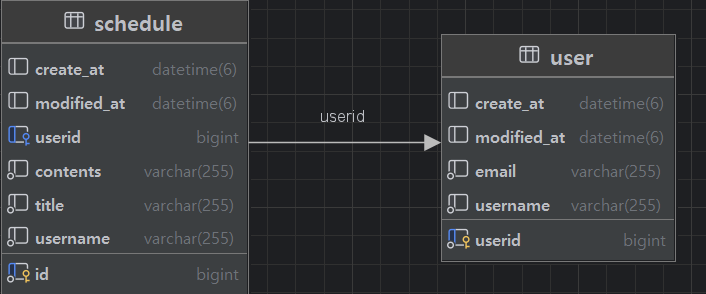

# 프로젝트 이름

“Simple Schedule Manager – 할 일 일정을 생성·삭제·수정하는 스케줄 관리 앱”

---

## 📋 목차
- [소개]
- [환경 설정]
- [기능 소개]
- [ API ] 
---

## 👋 소개
일정 제목,내용 등을 입력받아 아래 기능을 제공하는 Spring Boot 기반 웹/콘솔 앱입니다.
- **일정 생성**
- **일정 조회**
- **일정 수정**
- **일정 삭제**  
  

---

## 환경설정
- Java version "17.0.15" 2025-04-15  
- Mysql  version 9.3.0  
- Spring boot version  '3.4.5'

--- 

## ✨ 기능 소개
- 일정 생성 : 작성 유저명, 할 일 제목, 할 일 내용을 입력 받아 
 할 일 을 생성합니다.
- 일정 조회 : 전체 목록을 조회합니다.
- 일정 수정 : 식별자 값을 입력받아 해당 유저의 할 일 목록을 수정합니다.
 "할 일 제목","할 일 내용"만 수정이 가능합니다.
- 일정 삭제 : 식별자 값을 입력받아 해당 유저의 할 일 목록을 삭제합니다.

---
## 📡 Lv.1 API 요약

| 메서드    | url               | 설명          |
|--------|-------------------|-------------|
| POST   | `/schedules`      | 새로운 일정 생성   |
| GET    | `/schedules/{id}` | 특정 일정 목록 조회 |
| PATCH  | `/schedules/{id}` | 특정 일정 수정    |
| DELETE | `/schedules/{id}`  | 특정 일정 삭제    |

더 자세한 요청/응답 예시는 [Notion API 명세서](https://www.notion.so/1f83a6e1469d808c8825fa2e7b607250?v=1f83a6e1469d80c89832000c5181c990)를 참고하세요.
---
## 📡 Lv.2 API 요약

| 메서드    | url           | 설명          |
|--------|---------------|----------------|
| POST   | `/users`      | 회원 생성       |
| GET    | `/users/{id}` | 특정 회원 정보 조회 |
| PATCH  | `/users/{id}` | 특정 회원 정보 수정 |
| DELETE | `/users/{id}` | 특정 회원 삭제    |
                                            

## 더 자세한 요청/응답 예시는 [Notion API 명세서](https://www.notion.so/1f83a6e1469d8093b2a4f0fe9c744087?v=1fc3a6e1469d808e8b6e000cab1fd0b3&pvs=4)를 참고하세요.

---
## 📡 Lv.3,4 API 요약

| 메서드  | url           | 설명          |
|------|---------------|-----------------|
| POST | `/users`      | 회원 가입       |
| POST | `/users`      | 로그인 기능     |

## 더 자세한 요청/응답 예시는 [Notion API 명세서](https://comet-honeydew-090.notion.site/1ff3a6e1469d80a5bab9d2f2c0b13b6d?v=1ff3a6e1469d816897ef000ce21ad13f&pvs=4)를 참고하세요.

---
## 📡 ERD

